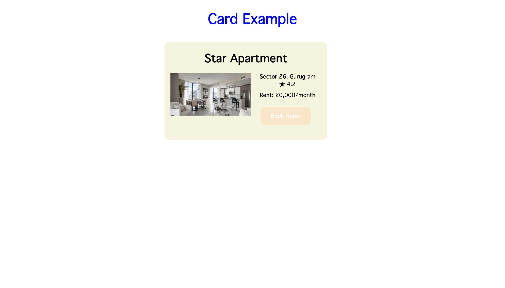

<html>
  <body>
    <h1>Example card made for coderscave internship</h1>
    <h3> Tools Used:</h3>
    <ul>
      <li> HTML </li>
      <li> CSS </li>
      <li> JavaScript </li>
    </ul>
    <h2>Screenshot</h2>
    
  </body>
</html>
